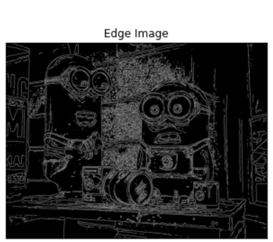

# Edge-Linking-using-Hough-Transform
## Aim:
To write a Python program to detect the lines using Hough Transform.

## Software Required:
Anaconda - Python 3.7

## Algorithm:
### Step1:
Import the packages.

### Step2:
Convert to gray scale.

### Step3:
Use canny edge detector.

### Step4:
Detect lines and apply hough transform.

### Step5:
Display result.


## Program:
```Python
Developed by:Shobika P
Register No: 212221230096


# Read image and convert it to grayscale image
import numpy as np
import  cv2
import matplotlib.pyplot as plt
img = cv2.imread("img.jpg")
img = cv2.GaussianBlur(image,(3,3),0)

plt.axis('off')
plt.imshow(img)
plt.show()


# Find the edges in the image using canny detector and display

edge = cv2.Canny(img,50,50)
plt.imshow(edge,cmap='gray')
plt.title('Edge Image')
plt.xticks([])
plt.yticks([])
plt.show()

# Detect points that form a line using HoughLinesP

lines=cv2.HoughLinesP(edge,1,np.pi/180, threshold=80, minLineLength=40,maxLineGap=250)


# Draw lines on the image

for line in lines:
    x1,y1,x2,y2 = line[0]
    cv2.line(edge,(x1,y1),(x2,y2),(255,0,255),3)

# Display the result
plt.imshow(edge)
plt.axis('off')
plt.show()


```
## Output

### Input image and grayscale image


### Canny Edge detector output



### Display the result of Hough transform


## Result:
Thus the program is written with python and OpenCV to detect lines using Hough transform. 
